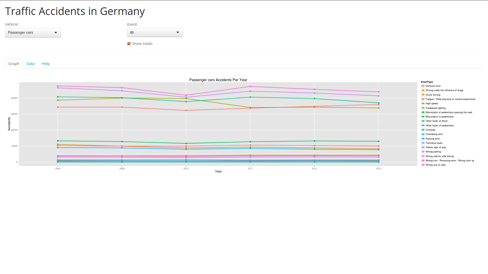

Traffic Accidents
========================================================
author: Marco Koch
date: Jul. 27th 2014

Introduction
========================================================
- This analysis is about events leading to traffic accidents in Germany. 
- Traffic accident data 'Unfallbeteiligte: Deutschland, Jahre, Art der Verkehrsbeteiligung, Fehlverhalten der Fahrzeugführer und Fußgänger' has been downloaded from GENESIS-Online database
- Link: https://www-genesis.destatis.de/genesis/online/link/tabellen/46241*
-  (C)Statistisches Bundesamt , Wiesbaden 2014
- Data downloaded: Jul. 20th, 2014

Data Processing
========================================================
The following steps has been applied to the raw data:

- Develop R function to read a specified section from the Excel source file and perform basic clean up
- Read data for each vehicle type
- Combine all information into one large data set
- Translate vehicle types and events to English language

```r
data$EventType[data$EventType=="Nicht angepasste Geschwindigkeit"] <- "High speed"
```

Results
========================================================
Several interesting plots and queries can be performed on the data, e.g.
- Plot all events related to the accidents
- Top three passenger cars events causing an accident in 2013


```
[1] "Wrong turn / Reversing error / Wrong start up"
[2] "Violate right of way"                         
[3] "Other faults of driver"                       
```

Results
========================================================
The following sample plot shows all passenger cars events from 2008 until 2013.


Shiny IO Application
========================================================
<p></p>
<a href="http://marco.shinyapps.io/traffic">http://marco.shinyapps.io/traffic</a>
